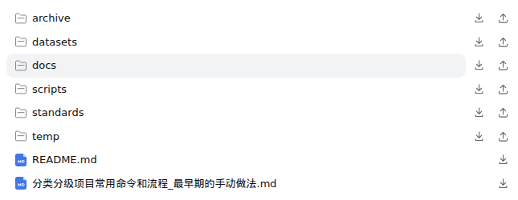
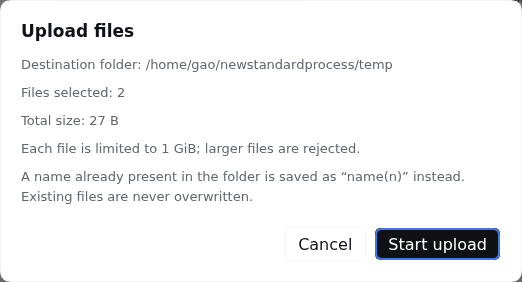
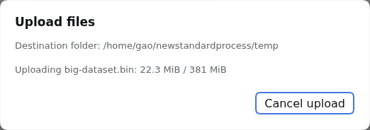

# dsh-file-transfer

English | [简体中文](README.zh.md)

A small DeepSeek Harness plugin that adds **download** and **upload** actions to the right-side document preview toolbar and to workspace folder/file rows.

## Features

### Download

- Downloads the currently previewed file under its original filename.
- Reads bytes through DSH's authenticated, session-scoped `workspaceFiles` Remote; the browser never touches the filesystem directly.
- Shows a confirmation dialog before reading file contents. For folders, a separate scan-progress dialog first reports that only directory entries and file sizes are read; after the scan, the confirmation reports total uncompressed size and file count before ZIP creation begins.
- Refuses files/folders whose uncompressed contents exceed 10 GiB. If a folder listing is truncated or any size cannot be established, the download is blocked rather than underreported.
- Files above 1 GiB are ZIP-compressed only when their extension indicates a text-like format. Folder files are sampled after confirmation; low-yield samples (under 5% savings) are stored without recompression. Binary/media files are not selected for compression based on their extension. The confirmation dialog first reports the uncompressed size, then updates with a sample-based estimated ZIP size during compression.
- Reads in 2 MiB ranges and verifies file identity/version while downloading. ZIP output is streamed directly to the chosen destination when the browser supports the File System Access save picker. The dialog remains open during transfer and its cancel button aborts the read/compression and removes the incomplete destination.
- Uses the browser's streaming save picker for large output. Without it, output over 256 MiB is refused to avoid buffering a multi-gigabyte download in browser memory.

### Upload

- Adds an upload button next to the download button on **folder rows** (`📁 reports  ↓ ↑`), so files can be dropped into that exact folder.
- Opens a multi-select file picker: several files can be queued in one go. Only files are accepted — there is no recursive folder upload.
- Re-confirms the target path, the file count and the total size before a single byte is sent, and re-checks that the tab still shows the session the folder belongs to.
- Hard limit of **1 GiB per file**; larger files are refused before the upload starts.
- Streams straight to disk in bounded chunks: the browser reads the file from disk and the Host writes it as it arrives, so neither side ever holds the whole file in memory.
- Shows per-file byte progress and supports cancelling mid-transfer. The Host removes its staged temporary file, so a cancelled upload never leaves a partial file behind.
- Existing names are **never overwritten**: `report.txt` is stored as `report(1).txt`, then `report(2).txt`, and so on.
- The folder tree reloads automatically once the upload finishes, so the new entries appear immediately.

The Host's existing session and filesystem authorization still applies. This plugin does not bypass file permissions.

## Screenshots

Folder rows carry both actions — download (↓) and upload (↑); file rows keep download only:



An upload re-confirms the destination folder, the file count and the total size before anything is sent:



It then reports per-file progress and can be cancelled mid-transfer, which removes the staged file:



## How uploads are authorized

Downloading uses DSH's `workspaceFiles` Remote, which is read-only, so uploads go through a small Host route owned by this plugin:

```
POST /dsh-file-transfer/upload?sessionId=<id>&directory=<path>&name=<file>
     content-type: application/octet-stream
     body: the raw file bytes
```

The route never trusts a browser-supplied filesystem path:

1. The request must be same-origin.
2. The session id must name a **live** session; the target directory is resolved relative to that session's immutable `cwd` through its own filesystem provider.
3. The resolved directory must be contained in that session's workspace **and** must already exist as a directory.
4. The body is capped at 1 GiB and staged in a hidden temp file inside the destination folder.
5. The finished file is published with an atomic, no-overwrite hard link, so a partially written upload is never visible and an existing file is never truncated. Name collisions are resolved by adding an `(n)` suffix.
6. Every failure path deletes the staged temp file.

The route is added by the plugin's Host entry; nothing in DSH core is patched.

## Requirements

- DSH Web `0.1.7-rc.2` or newer, with the document preview and workspace file Remote enabled.
- A session whose workspace lives on a filesystem the Host can write.

## Install

From the DSH plugin market, search for **dsh-file-transfer** and install it into the desired profile. Restart the DSH Web service and hard-refresh the browser page after installation.

You can also install directly from this GitHub repository:

```bash
dsh plugin --profile web add github:flyhigao/dsh-file-transfer
```

For local development:

```bash
dsh plugin --profile web add file:/path/to/dsh-file-transfer
```

## Use

### Download

1. Open a file from the right-side Files tab so it appears in the document preview.
2. Click the download icon beside the preview's reload button.
3. The browser saves the original file under its original basename. Use the download icon on a folder row to create a ZIP with that folder as the archive's top-level directory.

Every download first shows a confirmation dialog with the uncompressed size and planned behavior. A single file above 1 GiB is ZIP-compressed when its extension is recognized as text-like; likely binary/media formats are not recompressed. Folder downloads always produce a ZIP with the folder name as the top-level directory. The 10 GiB limit applies to the sum of the uncompressed input bytes, not the ZIP output size. Large output requires a browser that supports streaming to a save location; otherwise outputs above 256 MiB are refused. Compression behavior and ratios are estimates based on filename extensions, not content inspection.

### Upload

1. In the right-side Files tab, hover a **folder** row. A download icon and an upload icon appear.
2. Click the upload icon (↑) — a file picker opens; select one or more files.
3. Review the destination folder, file count and total size in the confirmation dialog, then start the upload.
4. Progress is shown per file. Cancel at any time; the Host removes the incomplete temporary file.
5. The tree reloads when the upload finishes. If a name already existed, the new file appears with an `(n)` suffix.

## Package layout

- `lib/index.js` — Host plugin entry; registers the upload route.
- `lib/upload-route.js` — the streaming, workspace-confined upload handler.
- `client/client.js` — client-side download action, upload dialog and tree row buttons.
- `cordis.patch.yml` — adds the package to a profile's bundle.
- `package.json` — DSH installable bundle and browser injection manifest.

The preview-toolbar contribution uses the additive `sidebar.right.tab.document.actions` slot. Folder/file row buttons are attached to the current Files tab DOM because DSH 0.1.7 does not expose a per-row action slot; this enhancement does not modify DSH core packages, but it may need adapting if the upstream Files view changes.

## Development checks

```bash
node --check lib/index.js
node --check lib/upload-route.js
node --check client/client.js
npm pack --dry-run
```

## License

MIT. See [LICENSE](LICENSE).
